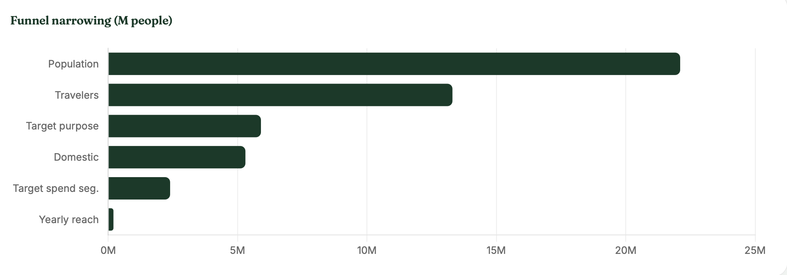
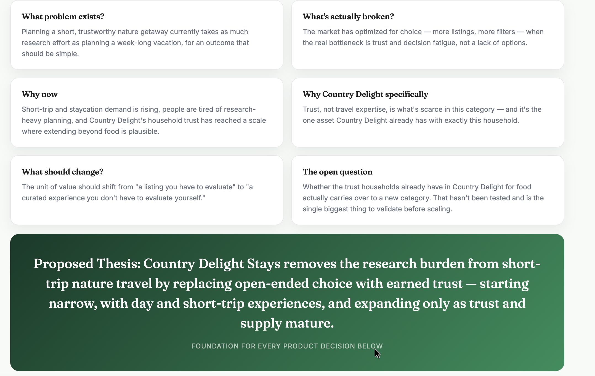
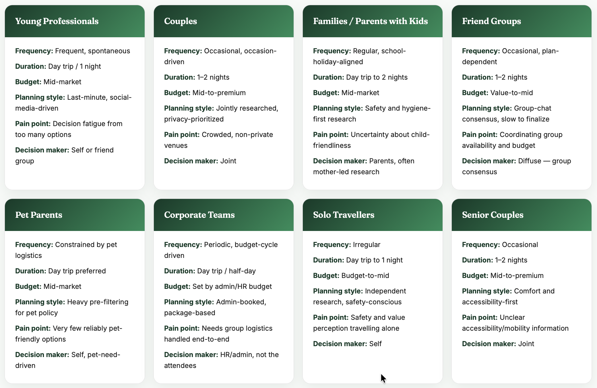
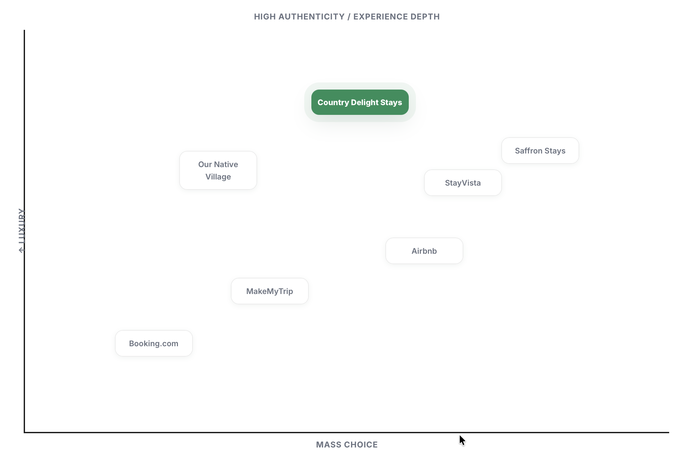
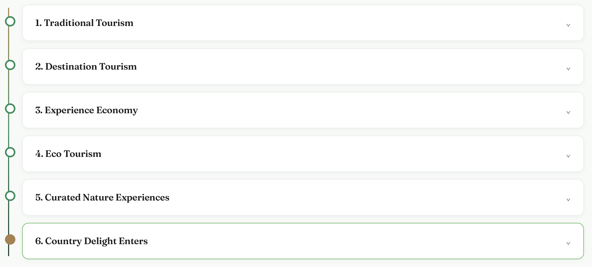
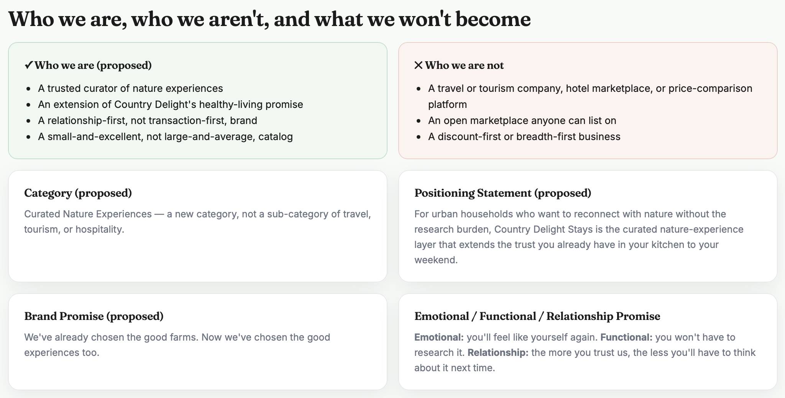
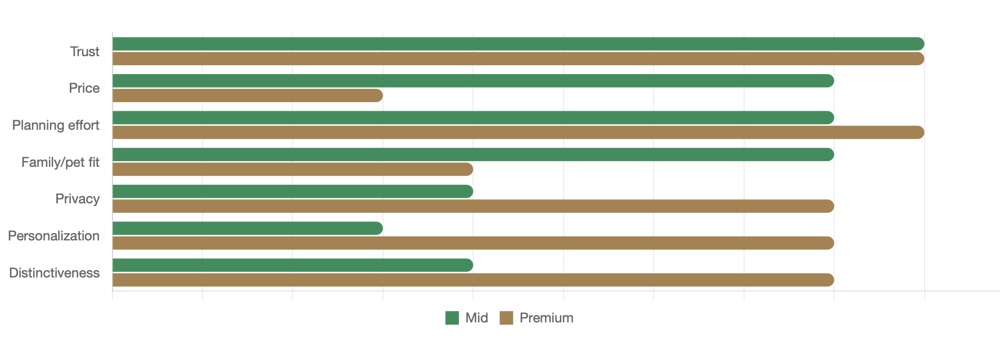
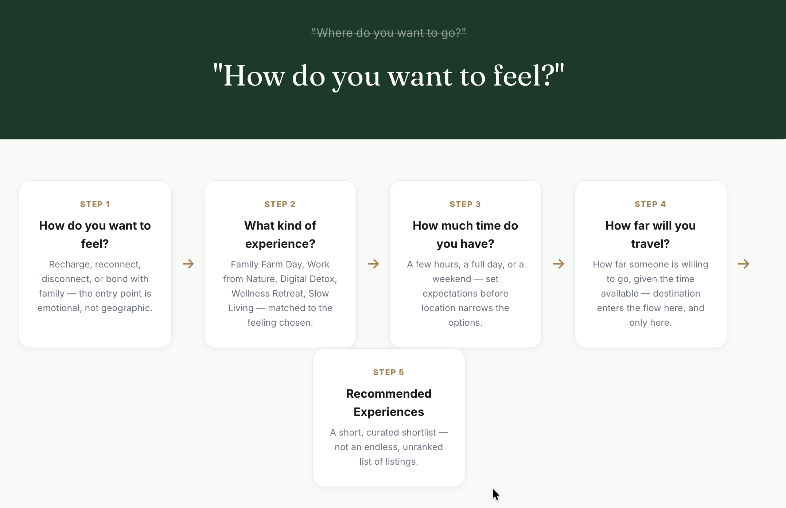

# 🌿 Country Delight Stays — Market & Product Research
### Product Strategy Internship Project @ Country Delight

An end-to-end discovery and strategy exercise assessing whether, and how, Country Delight should extend its brand into a new adjacent category: curated nature and eco-tourism experiences.

During my internship, I built a population-down market-sizing model, structured a hypothesis-driven customer research framework, benchmarked the competitive landscape, and authored a product strategy document — giving the Product team an evidence base for deciding whether the category is worth pursuing, and if so, in what shape.

---

## 📌 Project Overview

The goal of this project was to evaluate the opportunity for Country Delight to enter curated nature experiences, and to propose a positioning and go-to-market approach if the opportunity held up.

Unlike a validated market with existing usage data, this was a pre-launch category with no user base to draw on — so the work was built and labeled explicitly as a hypothesis framework to be tested, not a report of completed findings.

This project involved:

- Building a bottom-up and population-down market sizing model
- Structuring customer segments, personas, and Jobs-to-be-Done as testable hypotheses
- Mapping the end-to-end trip-planning journey and decision drivers
- Benchmarking the competitive landscape and identifying white space
- Proposing a category taxonomy, positioning, and phased go-to-market plan
- Authoring a full product strategy document with logged assumptions and open questions

---

## 📊 Research Summary

| Metric | Value |
|---|---:|
| Market analyzed | Mumbai (representative metro) |
| Target spend segments | Mid (₹3,000–5,000/day) + Premium (₹10,000+/day) |
| Combined target segment size | ~2.39M people |
| Realistic yearly reach (10% of segment) | ~239K people |
| Hypothesized customer personas | 8 |
| Competitors benchmarked | 9, across 3 categories |



> Note: All customer research is labeled as hypothesis, not validated finding — no primary interviews or surveys had been conducted at the time of this work.

---

## 🎯 Business Problem

Country Delight has an earned trust relationship with millions of urban households through food and dairy delivery, but no presence in how those same households spend their weekends.

Existing options in the nature/short-trip travel space force a trade-off the target customer doesn't want:

- Accommodation platforms (Airbnb, MakeMyTrip, StayVista) optimize for choice, not curation
- Informal farm stays are authentic but not discoverable or trustworthy
- Nobody combines trust, healthy living, food, and nature into a single curated ecosystem

The open question — and the highest-priority thing to validate — was whether Country Delight's existing trust in food actually transfers to a new experience category.



---

## 🔍 Methodology

### 1. Market Sizing
I built a population-down funnel for Mumbai — from total city population through travel purpose, domestic/international split, and spend segment — with every step backed by a named, auditable assumption rather than an invented figure. The Budget segment was deliberately excluded as a poor fit for the brand's positioning.

### 2. Customer & Behavioural Research
Since no user base existed to survey, I structured customer understanding as an explicit set of testable behavioural hypotheses grounded in secondary research and Jobs-to-be-Done reasoning — eight household-level personas, a full trip-planning journey, and a ranked set of decision drivers and pain points.



### 3. Product & Competitive Analysis
I benchmarked nine adjacent players across accommodation platforms, experience platforms, and nature-experience brands, plus the two nearest curated-stay operators (StayVista, SaffronStays), and traced the category's evolution through six stages to identify the specific opening for Country Delight.





### 4. Product Strategy
I synthesized the above into a proposed mission, vision, positioning, and product principles, along with a phased go-to-market sequence and an appendix logging every key assumption, trade-off, and open question the recommendation rests on.



---

## 🚨 Key Findings

### 1. No Combined Trust + Curation Player Exists
Every competitor benchmarked was either transaction-optimized, overwhelming in raw choice, poorly discoverable, or low-trust. None combined trust, healthy living, food, nature, and family into one curated ecosystem — that combination, not inventory size, is the identified white space.

### 2. Mid and Premium Segments Want Different Things
The Mid segment (young professionals, families) weighs trust, price transparency, and low planning effort most heavily. The Premium segment (couples, celebration occasions) weighs zero-planning-effort, privacy, and personalization far more than price — the two segments cannot be served by one generic experience design.



### 3. Decision Fatigue, Not Lack of Options, Is the Core Pain Point
Across every hypothesized segment, the recurring frustration was too many unranked, unverified choices — not too few. This points toward a curated shortlist model over an open marketplace model.

### 4. "How Do You Want to Feel" as the Core Differentiator
Every existing platform reviewed leads discovery with geography ("where do you want to go"). Leading with feeling instead was identified as the single biggest structural differentiator available against incumbents.



### 5. The Trust-Transfer Assumption Is Untested
The entire strategic thesis depends on Country Delight's food/sourcing trust transferring to a new category — this has never been tested directly and is flagged throughout as the top validation priority before any scale decision.

---

## 📈 Reports

The research was delivered as five interactive HTML reports covering market sizing, user research, segment needs analysis, competitive/product analysis, and product strategy.

### Live Reports

Each report is hosted and viewable directly in the browser — no download needed:

| File | Live Link |
|---|---|
| `CD_Market_Sizing.html` | [View](https://ria-chadha-05.github.io/Country_Delight_Stays/CD_Market_Sizing.html) |
| `USER_STUDY.html` | [View](https://ria-chadha-05.github.io/Country_Delight_Stays/USER_STUDY.html) |
| `Mid_Premium_Segment_Needs.html` | [View](https://ria-chadha-05.github.io/Country_Delight_Stays/Mid_Premium_Segment_Needs.html) |
| `PRODUCT_ANALYSIS.html` | [View](https://ria-chadha-05.github.io/Country_Delight_Stays/PRODUCT_ANALYSIS.html) |
| `PRODUCT_STRATEGY.html` | [View](https://ria-chadha-05.github.io/Country_Delight_Stays/PRODUCT_STRATEGY.html) |

---

## 🛠 Tools & Technologies

### Analytics
- Market sizing (population-down funnel modeling)
- Secondary research synthesis (IBEF, Statista, Grand View Research, IMARC Group, government tourism data)
- Jobs-to-be-Done framework

### Product / Strategy Analysis
- Customer segmentation and persona development
- Competitive benchmarking and white-space analysis
- Product positioning and category taxonomy
- Go-to-market sequencing

### Visualization
- HTML
- CSS
- JavaScript
- Chart.js

---

## 📂 Repository Structure

```text
country-delight-stays/
├── README.md
├── CD_Market_Sizing.html
├── USER_STUDY.html
├── Mid_Premium_Segment_Needs.html
├── PRODUCT_ANALYSIS.html
├── PRODUCT_STRATEGY.html
└── assets/
    ├── Mumbai_Funnel.png
    ├── problem_analysis.png
    ├── behavioural_segment.png
    ├── competitive_positioning.png
    ├── evolution.png
    ├── who_we_are.png
    ├── segment.png
    └── insight.png
```

---

## 💡 Impact

This workstream gave the Product team a concrete, ready-to-run plan for validating the customer hypotheses in the next research phase, alongside a full evidence base spanning:

- Market sizing and reach modeling
- Competitive positioning and white space
- Customer segments, personas, and decision drivers
- A phased go-to-market recommendation

The recommended approach is deliberately narrow: 2–4 vetted partners, one metro-adjacent corridor, day experiences before immersive overnight formats — expanding only as trust and supply mature.

---

## 📚 Key Learnings

Through this project, I gained hands-on experience in:

- Market sizing and funnel modeling
- Hypothesis-driven customer research
- Jobs-to-be-Done and persona development
- Competitive benchmarking and white-space analysis
- Product positioning and strategy synthesis
- Structuring open-ended, self-directed research problems

---

## 📄 Additional Internship Work

Alongside this research, I also worked on other product initiatives, including:

- An end-to-end audit of Country Delight's customer-facing chatbot (Ayuh Bot)
- Ideation and prototyping for a ₹9 Store feature to improve Average Order Value
- The Vaishali project — an independently owned, end-to-end product exercise building an AI-powered consumer electronics shopping platform

---

## Disclaimer

This repository contains only research artifacts and hypothesis-framed analysis.

No customer-identifiable information, proprietary datasets, or internal company systems are included. Market sizing figures rest on named, publicly available secondary sources and explicit assumptions — not on Country Delight's internal or proprietary data.
